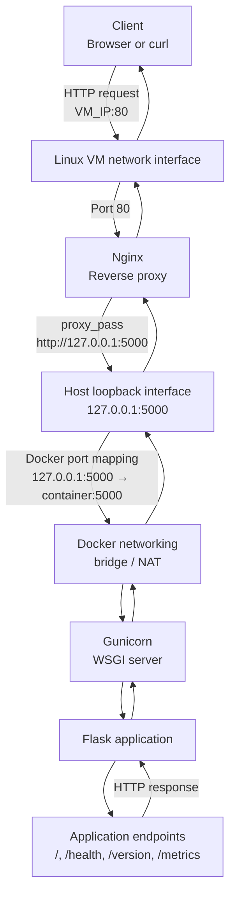
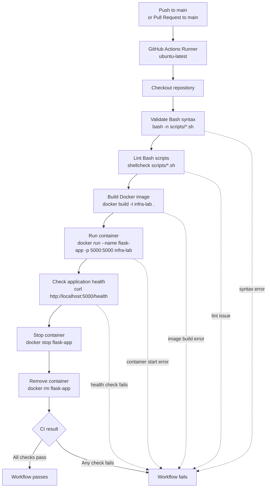

# Linux Networking & Containerised Service Deployment

A self-hosted Linux environment for deploying, routing, securing, and validating a containerised Flask/Gunicorn service through Docker, Nginx, UFW, SSH, and Bash automation.

## Project Overview

This project implements a small production-like service environment for deploying and operating a containerised web application on a Linux host.

The application runs as a Flask/Gunicorn service inside Docker and is exposed through an Nginx reverse proxy on the host. Bash scripts automate the build, run, configuration, validation, and cleanup workflows, while smoke tests verify that the deployed service responds correctly through the expected network path.

The environment is hosted on a local Linux VM and administered over SSH using key-based access. Supporting infrastructure includes UFW firewall rules, host-level file permission controls, Docker port mappings, Nginx configuration validation, and troubleshooting procedures for failures across the Linux host, container runtime, networking layer, and application service.

### Tech Stack

## Architecture

**System Traffic Flow Chart**

**CI Flow Chart**

## Key Features

- **GitHub Actions CI:** built a GitHub Actions workflow to automatically validate Bash script syntax, run ShellCheck, build the Docker image, start the Flask/Gunicorn container, and test the end-to-end request flow across the application endpoints.

- **Bash Automation:** created Bash scripts to automate the deployment workflow, including network diagnostic checks, Docker image builds, Nginx configuration validation and reloads, container deployment, endpoint testing, and clean-up.

- **Containerised runtime with Docker:** packaged the app, dependencies, exposed port, and startup command into a reproducible image so the same build can run consistently across CI and compatible Linux AMD64 deployment environments.

- **Nginx Reverse Proxy:** configured Nginx as the public HTTP entry point on port 80, proxying requests to the Docker-hosted backend exposed on the host loopback interface. This reduced direct network exposure for the backend, separated public traffic handling from the application runtime, and provided a central layer for access logging, request header forwarding, and future TLS termination.

- **SSH-based remote administration:** configured key-based SSH access to manage the Linux VM, run deployment scripts, troubleshoot Docker/Nginx issues, and validate service health from the command line. Configured Linux ufw to only accept SSH and Nginx http traffic. 

## Challenges

### Diagnosing Docker Container Networking After VM Resume

**Symptom:** 

Pip install failure for `requirements.txt` on Docker image build as docker couldn't resolve or reach external package repositories

**Investigation:**

* Verified it wasn't a core dependency problem due to using the Python slim image, but a networking issue
* Tested DNS resolution and ping to an IP from the VM host
* Ran the base image on its own and had it run commands for DNS resolution and connection to an IP from inside the container; both failed
* Checked the existence of the Docker bridge subnet and `docker0` interface
* Examined VM routing tables and found the route to the Docker bridge subnet was missing

**Likely Root Cause:**

Suspending the VM and resuming it without completely powering it off likely caused some of Docker’s networking state to not be fully restored, resulting in the missing route for the Docker subnet

**Resolution:**

Restarted the Docker service to restore connectivity to containers, and going forward I’ll fully power off the VM instead of relying on suspend/resume when Docker networking is active.

### Validating Nginx Reverse Proxy Configuration

**Symptom:** Browser couldn't reach the application through Nginx after new configuration file changes

**Investigation:**

* Examined Nginx status on the VM
* Validated configuration with `nginx -t`

**Likely Root Cause:**

There were directive syntax errors in the configuration file I created, so Nginx could not safely reload the new configuration and proxy traffic to my backend correctly.

**Resolution:**

Corrected the syntax errors identified by `nginx -t`. Moving forward, this reinforced the importance of validating all configuration and code before deployment, especially when changes affect the application's entry point.
